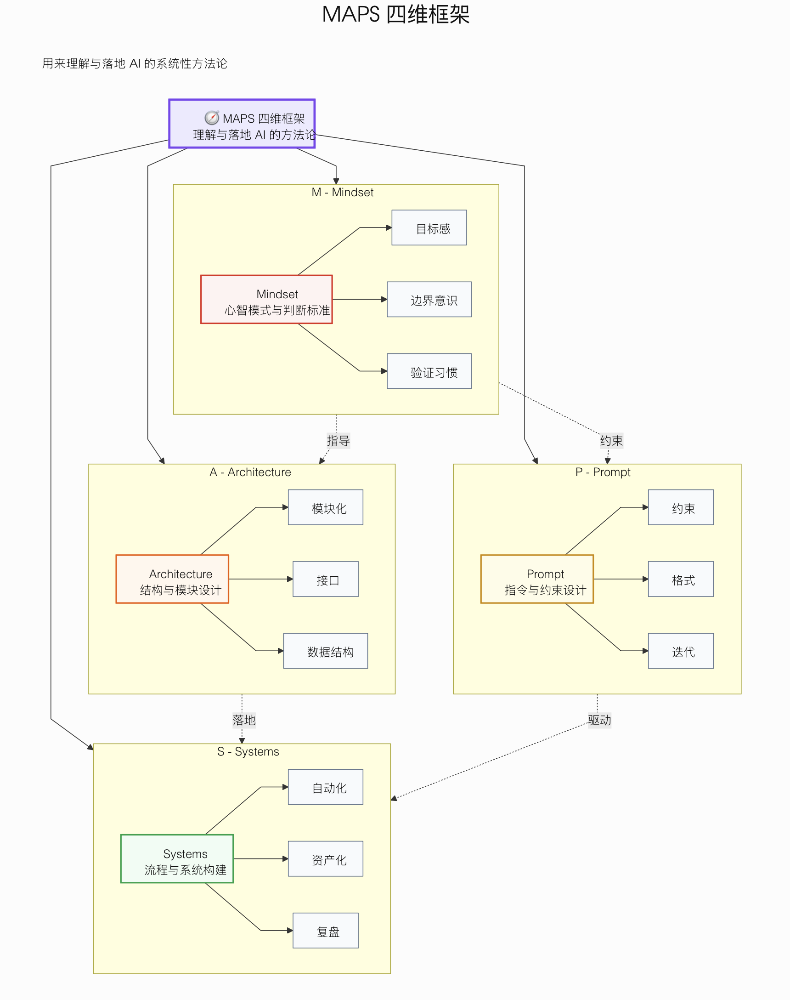
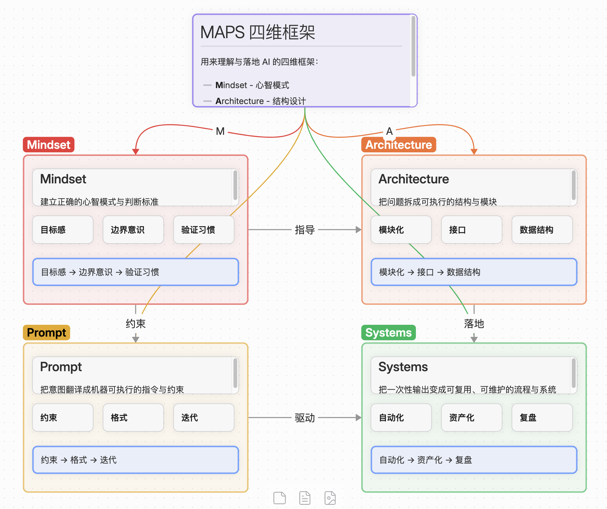
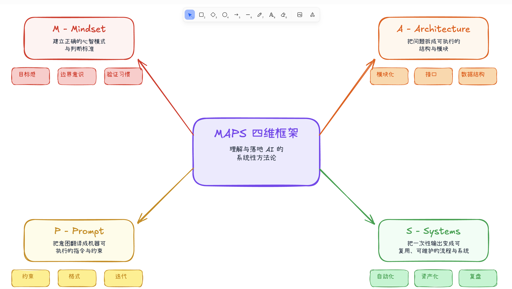

# CC-Atlas-Skills

Claude Code 高级技能集合（Skills Collection），提供标准化的开发工作流与可视化工具。

## 📦 技能列表 (Skills)

| 技能名称 | 描述 | 触发命令 |
| :--- | :--- | :--- |
| **[Django Development](./django/README.md)** | Django/DRF 企业级开发套件。包含模型设计、API 生成、ORM 优化、安全检查及测试策略。 | `/django` |
| **[Mermaid Visualizer](./mermaid-visualizer/README.md)** | 专业的 Mermaid 图表生成器。支持流程图、时序图、类图、状态图等，自动修正语法错误。 | `/mermaid-visualizer` |
| **[Obsidian Canvas](./obsidian-canvas-creator/README.md)** | Obsidian Canvas 布局生成器。支持生成思维导图 (MindMap) 和自由布局 (Freeform) 的 `.canvas` 文件。 | `/obsidian-canvas-creator` |
| **[Excalidraw Diagram](./excalidraw-diagram/README.md)** | Excalidraw 风格图表生成器。将文本逻辑转换为手绘风格的流程图、架构图与思维导图。 | `/excalidraw-diagram` |
| **[Baidu Search](./baidu-search/README.md)** | 百度 AI 搜索工具。集成千帆 AI Search API，支持中文互联网搜索、站点过滤、时效过滤。 | `/baidu-search` |
| **[Baidu PPT](./baidu-ppt/README.md)** | 百度智能 PPT 生成工具。基于大纲自动生成专业演示文稿，支持多种风格模板。 | `/baidu-ppt` |

## 🎨 效果展示

### Mermaid Visualizer


### Obsidian Canvas Creator


### Excalidraw Diagram


## 🚀 安装指南

### 方式 1：通过 Marketplace 安装（推荐）

直接在 Claude Code 终端执行：

```bash
# 1. 添加插件源
claude plugin marketplace add Atlas-SZ/CC-Atlas-Skills

# 2. 安装所需技能
claude plugin install django@cc-atlas-skills
claude plugin install mermaid-visualizer@cc-atlas-skills
claude plugin install baidu-search@cc-atlas-skills
```

### 方式 2：本地手动安装

适用于开发者或需要修改源码的场景：

```bash
# 1. 克隆仓库
git clone https://github.com/Atlas-SZ/CC-Atlas-Skills.git
cd CC-Atlas-Skills

# 2. 创建软链接 (以 django 为例)
ln -sf "$(pwd)/django" ~/.claude/skills/django

# 3. 验证安装
ls -l ~/.claude/skills/django
```

## 💡 使用方法

在 Claude Code 会话中，你可以通过以下方式使用技能：

1. **Slash 命令（推荐）**
   直接输入命令唤起技能：
   - `/django` - 启动 Django 开发助手
   - `/mermaid-visualizer` - 生成图表

2. **自然语言触发**
   Claude 会根据对话上下文自动建议使用相关技能：
   > "帮我设计一个用户订单系统的数据库模型" → 触发 Django Skill
   > "画一个支付流程的时序图" → 触发 Mermaid Visualizer

## 🛠️ 项目结构

```text
CC-Atlas-Skills/
├── .claude-plugin/        # Marketplace 配置文件
├── django/                # Django 开发技能包
├── mermaid-visualizer/    # Mermaid 图表生成
├── obsidian-canvas-creator/ # Obsidian Canvas 生成
├── excalidraw-diagram/    # Excalidraw 生成
├── baidu-search/          # 百度 AI 搜索
└── baidu-ppt/             # 百度智能 PPT 生成
```

## 🤝 贡献

欢迎提交 Issue 和 PR。添加新 Skill 时，请参考现有目录结构，并更新 `.claude-plugin/marketplace.json`。

## 📄 License

MIT License
